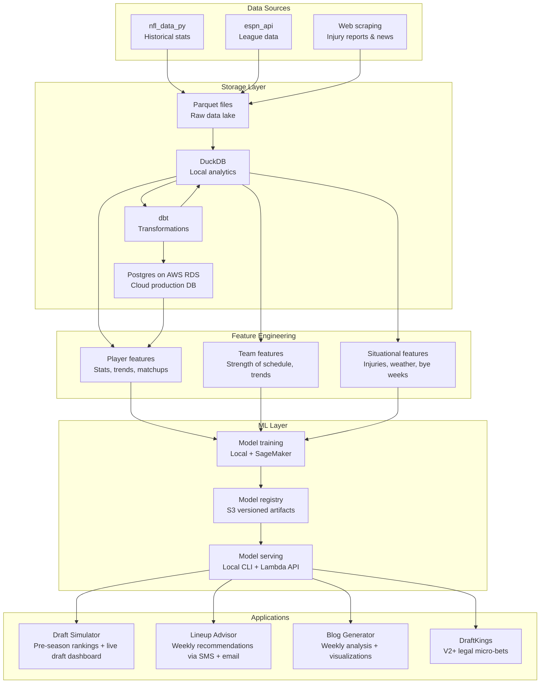

# Architecture — Fanstatsy Foosball

## System Overview

Fanstatsy Foosball is a Python-based ML system with six major layers. Data flows top to bottom; applications sit on top of the ML layer and serve predictions to the user via CLI, notifications, dashboards, and blog content.



## Layer 1: Data Ingestion

### Sources

| Source | Package/Method | Data | Frequency |
|--------|---------------|------|-----------|
| NFL historical stats | `nfl_data_py` | Play-by-play, weekly stats, rosters, draft picks (back to ~1999) | One-time bulk load + annual refresh |
| ESPN Fantasy League | `espn_api` | League rosters, matchups, scores, free agents, transactions, draft state | Weekly during season; real-time during draft |
| Injury reports | Web scraping (ESPN, NFL.com) | Player injury status, practice participation | Daily during season |
| News & analysis | Web scraping / RSS | Player news, coaching changes, depth chart updates | Daily during season |
| Pro Football Reference | `sportsipy` or scraping | Supplementary stats, historical records | As needed |

### Ingestion Pattern

Raw data lands as **Parquet files** in a local data lake directory structure:

```
data/
  raw/
    nfl_stats/        ← play-by-play, weekly stats from nfl_data_py
    espn_league/      ← league-specific data from espn_api
    injuries/         ← scraped injury reports
    news/             ← scraped news feeds
  processed/          ← dbt output (cleaned, joined, feature-ready)
  models/             ← trained model artifacts (local copy)
```

Ingestion scripts are Python modules that fetch, validate, and write Parquet. Each source gets its own module with a consistent interface.

## Layer 2: Storage & Transformation

### Evolution Path

The storage stack evolves as the project matures — each stage teaches new skills:

| Phase | Stack | Learning goals |
|-------|-------|----------------|
| **Phase 1** | DuckDB + Parquet files | Columnar analytics, SQL on local data, fast ML iteration |
| **Phase 2** | Add dbt (dbt-duckdb adapter) | Data transformation best practices, data testing, lineage tracking |
| **Phase 3** | Add Postgres on AWS RDS free tier | CDK/CloudFormation, managed DB ops, SQL in production, migration patterns |
| **Phase 4** | S3 + dbt + Postgres | Cloud data lake pattern, scheduled cloud pipelines |

### Why DuckDB First

DuckDB is an embedded analytics database (like SQLite but optimized for analytical queries). It reads Parquet files natively, runs SQL, and requires zero setup. For the data volumes in fantasy football (thousands of players x ~20 years x weekly stats), DuckDB will be fast enough for everything — data exploration, feature engineering, and feeding ML training.

Moving to Postgres later is a learning exercise in cloud infrastructure, not a necessity.

### dbt Layer

dbt (data build tool) manages SQL transformations as version-controlled, tested code. It turns raw data into clean, analysis-ready tables.

Key dbt models to build:
- `stg_*` — staging models that clean raw source data
- `int_*` — intermediate models that join and enrich
- `fct_*` — fact tables (player game stats, matchup results)
- `dim_*` — dimension tables (players, teams, seasons)
- `feat_*` — feature tables purpose-built for ML model input

dbt tests validate data quality at every transformation step — catching issues before they corrupt model training.

### Constraint

**Storage must never block ML work.** If a storage migration is in progress, ML pipelines must still be able to read from the previous source. Feature engineering code reads from an abstraction layer, not directly from a specific database.

## Layer 3: Feature Engineering

Features are the inputs to ML models — they transform raw stats into signals that predict player performance.

### Feature Categories

**Player-level features:**
- Rolling averages (last 3, 5, 10 games)
- Trend indicators (improving/declining)
- Position-specific stats (rushing yards for RBs, targets for WRs, etc.)
- Fantasy points per game (PPG) and variance
- Red zone usage and efficiency
- Snap count percentage and trends

**Team-level features:**
- Offensive and defensive rankings
- Strength of schedule (upcoming and historical)
- Pace of play
- Points allowed by position (how much does this defense give up to WRs?)

**Situational features:**
- Injury status (healthy, questionable, doubtful, out)
- Home vs. away performance splits
- Weather conditions (outdoor games)
- Bye week effects (week before and after)
- Divisional rivalry performance

**Matchup features:**
- Player-vs-defense historical performance
- Defensive weakness exploitation (this WR vs. that CB)

### Feature Store

Features are computed via dbt and stored in feature tables. ML training reads from these tables. This separation means features are reusable across different models and experiments.

## Layer 4: ML Models

### Model Architecture (to be refined during learning)

The model architecture will evolve as statistical and ML concepts are learned. Starting simple and adding complexity as understanding grows:

| Phase | Approach | Concepts learned |
|-------|----------|-----------------|
| **Foundations** | Exploratory data analysis, descriptive statistics | Distributions, correlations, hypothesis testing |
| **Baseline** | Linear regression, logistic regression | Supervised learning, loss functions, overfitting, train/test splits |
| **Intermediate** | Random forests, gradient boosting (XGBoost/LightGBM) | Ensemble methods, feature importance, hyperparameter tuning |
| **Advanced** | PyTorch neural networks | Deep learning fundamentals, backpropagation, custom architectures |
| **Ensemble** | Combining multiple models | Model stacking, blending, when ensembles help vs. hurt |

The decision between single model, ensemble, or other architectures should be driven by data and experimentation — not decided upfront. Each approach will be explored in learning notebooks before being productionized.

### Model Lifecycle

1. **Experiment** in Jupyter notebooks (explore, visualize, iterate)
2. **Productionize** into Python modules (clean code, reproducible training)
3. **Train** locally first, then on SageMaker for scale/learning
4. **Version** model artifacts in S3 (track what was trained on what data)
5. **Serve** locally via CLI for development; via Lambda + API Gateway for production
6. **Monitor** prediction accuracy against actual game outcomes weekly

### Key Prediction Tasks

- **Player projection:** predict fantasy points for a player in a given week
- **Player valuation:** rank players for draft value (auction $ or pick position)
- **Lineup optimization:** given your roster and projections, which players should start?
- **Matchup analysis:** given two teams' lineups, who's favored and by how much?

## Layer 5: Applications

### Draft Simulator

**Used:** Pre-season (late summer 2026)

**Components:**
- **Ranking engine** — model-powered player rankings with confidence intervals
- **Draft board** — your ranked list, updated as picks happen
- **Live draft dashboard** — local web app (Flask/Streamlit) that polls ESPN API during the live draft, shows remaining players re-ranked in real time as others pick, surfaces "best available" within 90-second clock
- **Simulation mode** — run thousands of mock drafts pre-season to test strategies

**Real-time draft approach:**
Poll `espn_api` every few seconds during the live draft to detect new picks. Instantly recalculate rankings for remaining players. Display on a local dashboard (second screen). Fast, deterministic, no AI agent making draft-day decisions — the models pre-compute the math, you make the call.

### Lineup Advisor

**Used:** Weekly during NFL season (September 2026 – January 2027)

**Components:**
- **Weekly analysis pipeline** — runs mid-week, ingests latest injury reports, news, matchup data
- **Recommendation engine** — runs model(s), produces ranked lineup with statistical reasoning
- **Notification system** — pushes recommendation via:
  - **Email** (AWS SES, free tier: 200 emails/day)
  - **SMS** (AWS SNS, free tier: 100 SMS/month — plenty for weekly alerts)
- **Reasoning report** — each recommendation includes why (matchup advantage, injury impact, trend data) with confidence levels

**Notification content example:**
> **Week 5 Lineup Recommendation**
> Start: Player A (WR) over Player B (WR)
> Reason: Player A faces the 30th-ranked pass defense. 82% confidence for 14+ fantasy points based on 3-game trend + matchup history. Player B is questionable (hamstring) and faces the #3 pass defense.
> Full analysis: [link to blog post or notebook]

### Blog Generator

**Used:** Weekly during season

**Components:**
- **Analysis notebooks** — Jupyter notebooks that pull weekly league data and generate insights
- **Visualization pipeline** — beautiful charts and graphics (Plotly for interactive, matplotlib/seaborn for static)
- **Publishing pipeline** — notebooks → rendered HTML → GitHub Pages (or Markdown → static site)
- **Content angle:** "Football stats from a person who's learning football through data" — accessible, honest, visually compelling

**Output formats:**
- Jupyter notebooks (portfolio display on GitHub)
- Blog posts on GitHub Pages (public-facing content)
- Markdown exports for Medium/Substack cross-posting

### DraftKings Integration (V2+)

**Used:** Post-MVP, once core system is proven

**Components:**
- DraftKings public contest API integration
- Lineup optimizer adapted for DraftKings salary cap format
- Small, legal micro-bet strategy based on model projections
- Separate risk management logic (strict bankroll limits)

**Not in scope for V1.** Noted here so architecture doesn't preclude it.

## Layer 6: Infrastructure

### Local Development

- **Python 3.11+** with virtual environments (venv or conda)
- **Jupyter Lab** for notebooks
- **DuckDB** for local analytics
- **dbt** for transformations
- **Git + GitHub** for version control and portfolio

### AWS Cloud (free tier + credits)

| Service | Purpose | Free tier |
|---------|---------|-----------|
| **RDS (Postgres)** | Production database | 750 hrs/month db.t3.micro for 12 months |
| **S3** | Data lake + model artifact storage | 5 GB storage, 20K GET, 2K PUT/month |
| **Lambda** | Model serving API | 1M requests/month, 400K GB-seconds |
| **API Gateway** | REST API for Lambda | 1M API calls/month |
| **SES** | Email notifications | 200 emails/day (when sent from Lambda) |
| **SNS** | SMS notifications | 100 SMS/month |
| **SageMaker** | Model training (learning) | 250 hrs/month ml.t3.medium for 2 months |
| **CloudFormation / CDK** | Infrastructure as code | Free (you pay for what it provisions) |

### Infrastructure as Code

All AWS resources defined via **CDK (Python)** — this is itself a learning exercise in cloud infrastructure. CloudFormation templates generated from CDK for portability.

### CI/CD (future)

GitHub Actions for:
- Run dbt tests on PR
- Lint and test Python code
- Deploy Lambda functions on merge to main
- Scheduled weekly pipeline runs (data ingestion → feature engineering → model inference → notifications)

## Security Boundaries

| Boundary | What crosses it | Protection |
|----------|----------------|------------|
| ESPN API | League data (contains member names to anonymize) | API credentials in environment variables, never in code |
| AWS | Model artifacts, notifications, database | IAM roles, least privilege, credentials via AWS CLI profiles |
| GitHub | All source code (public repo) | .gitignore for .env, credentials, local data files |
| Email/SMS | Lineup recommendations to yourself | SES/SNS configured for your verified email/phone only |

See `SECURITY_PRIVACY.md` for full threat model.

## Decisions to Make Later

These don't need answers now — they'll be resolved during the learning/building process:

- Single model vs. ensemble vs. other architecture (data-driven decision)
- Specific neural network architecture if/when we get to PyTorch (learning-driven)
- Blog platform choice (GitHub Pages vs. Hugo vs. other)
- Whether to add a web frontend beyond the draft dashboard
- GCP usage alongside AWS (may add Vertex AI notebooks for comparison learning)
