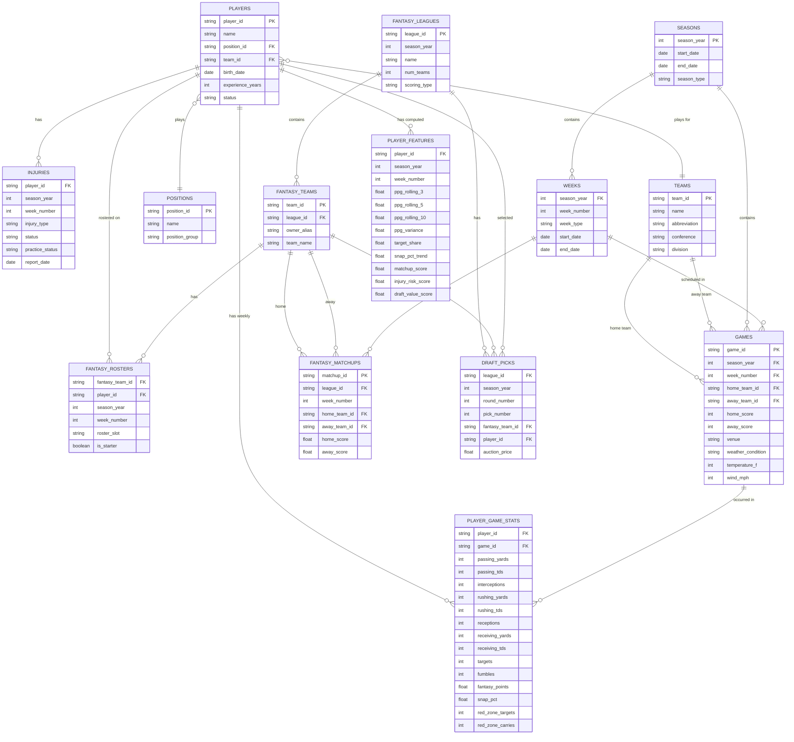

# Data Model — Fanstatsy Foosball

## Overview

The data model is organized into three tiers that mirror the dbt transformation layers:

1. **Source/Staging** — raw data as it arrives from external sources
2. **Core** — cleaned, joined, business-ready tables
3. **Features** — ML-ready tables purpose-built for model training and inference

Data flows: Sources → Staging → Core → Features → ML Models

## Entity Relationship Diagram

## Tier 1: Source / Staging Tables

These map directly to external data sources. Minimal transformation — just type casting, renaming, and deduplication.

### stg_nfl_players

Source: `nfl_data_py`

| Column | Type | Description |
|--------|------|-------------|
| player_id | string | Unique player identifier (from nfl_data_py) |
| name | string | Full name |
| position | string | Primary position (QB, RB, WR, TE, K, DST) |
| team | string | Current team abbreviation |
| birth_date | date | Date of birth |
| experience_years | int | Years in the NFL |
| status | string | Active, injured reserve, free agent, etc. |

### stg_nfl_games

Source: `nfl_data_py`

| Column | Type | Description |
|--------|------|-------------|
| game_id | string | Unique game identifier |
| season | int | Season year |
| week | int | Week number |
| home_team | string | Home team abbreviation |
| away_team | string | Away team abbreviation |
| home_score | int | Final home score |
| away_score | int | Final away score |
| game_date | date | Date of game |
| venue | string | Stadium name |
| weather | string | Weather description (outdoor games) |
| temperature | int | Temperature in Fahrenheit |
| wind | int | Wind speed in MPH |

### stg_nfl_player_stats

Source: `nfl_data_py` (weekly player stats)

| Column | Type | Description |
|--------|------|-------------|
| player_id | string | Player identifier |
| game_id | string | Game identifier |
| season | int | Season year |
| week | int | Week number |
| passing_yards | int | Passing yards |
| passing_tds | int | Passing touchdowns |
| interceptions | int | Interceptions thrown |
| rushing_yards | int | Rushing yards |
| rushing_tds | int | Rushing touchdowns |
| receptions | int | Receptions |
| receiving_yards | int | Receiving yards |
| receiving_tds | int | Receiving touchdowns |
| targets | int | Pass targets |
| fumbles | int | Fumbles lost |
| snap_pct | float | Percentage of team snaps played |
| red_zone_targets | int | Targets inside the 20-yard line |
| red_zone_carries | int | Carries inside the 20-yard line |

### stg_espn_league

Source: `espn_api`

| Column | Type | Description |
|--------|------|-------------|
| league_id | string | ESPN league identifier |
| season | int | Season year |
| league_name | string | League name |
| num_teams | int | Number of teams |
| scoring_type | string | PPR, half-PPR, standard, etc. |

### stg_espn_teams

Source: `espn_api`

| Column | Type | Description |
|--------|------|-------------|
| team_id | string | ESPN fantasy team identifier |
| league_id | string | League identifier |
| owner_alias | string | **Anonymized** owner identifier (not real names) |
| team_name | string | Fantasy team name |

### stg_espn_rosters

Source: `espn_api`

| Column | Type | Description |
|--------|------|-------------|
| fantasy_team_id | string | Fantasy team identifier |
| player_id | string | Player identifier |
| season | int | Season year |
| week | int | Week number |
| roster_slot | string | Slot (QB, RB1, RB2, WR1, WR2, FLEX, TE, K, DST, BN) |
| is_starter | boolean | Whether the player is in the starting lineup |

### stg_espn_matchups

Source: `espn_api`

| Column | Type | Description |
|--------|------|-------------|
| matchup_id | string | Matchup identifier |
| league_id | string | League identifier |
| week | int | Week number |
| home_team_id | string | Home fantasy team |
| away_team_id | string | Away fantasy team |
| home_score | float | Home fantasy points scored |
| away_score | float | Away fantasy points scored |

### stg_espn_draft

Source: `espn_api`

| Column | Type | Description |
|--------|------|-------------|
| league_id | string | League identifier |
| season | int | Season year |
| round | int | Draft round |
| pick | int | Overall pick number |
| fantasy_team_id | string | Team that picked |
| player_id | string | Player selected |
| auction_price | float | Auction price (null for snake drafts) |

### stg_injuries

Source: Web scraping (ESPN, NFL.com)

| Column | Type | Description |
|--------|------|-------------|
| player_id | string | Player identifier |
| season | int | Season year |
| week | int | Week number |
| injury_type | string | Body part / injury description |
| status | string | Healthy, Questionable, Doubtful, Out, IR |
| practice_status | string | Full, Limited, DNP (did not practice) |
| report_date | date | Date of injury report |

## Tier 2: Core Tables

Cleaned, joined, and business-logic-applied tables. These are the "single source of truth" tables that applications and features read from.

### dim_players

Slowly changing dimension — tracks player team changes across seasons.

| Column | Type | Description |
|--------|------|-------------|
| player_key | string | Surrogate key |
| player_id | string | Natural key from source |
| name | string | Full name |
| position_id | string | FK to dim_positions |
| team_id | string | FK to dim_teams (current) |
| birth_date | date | Date of birth |
| experience_years | int | Years in NFL |
| status | string | Current status |
| valid_from | date | When this record became active |
| valid_to | date | When this record was superseded (null if current) |

### dim_teams

| Column | Type | Description |
|--------|------|-------------|
| team_id | string | Team abbreviation (PK) |
| name | string | Full team name |
| conference | string | AFC / NFC |
| division | string | North / South / East / West |

### dim_positions

| Column | Type | Description |
|--------|------|-------------|
| position_id | string | Position abbreviation (PK) |
| name | string | Full position name |
| position_group | string | Offense / Defense / Special Teams |
| is_fantasy_relevant | boolean | Relevant for fantasy scoring |

### fct_player_games

The central fact table — one row per player per game with all stats and computed fantasy points.

| Column | Type | Description |
|--------|------|-------------|
| player_id | string | FK to dim_players |
| game_id | string | FK to fct_games |
| season | int | Season year |
| week | int | Week number |
| team_id | string | Team player was on for this game |
| opponent_id | string | Opposing team |
| is_home | boolean | Home game flag |
| passing_yards | int | Passing yards |
| passing_tds | int | Passing TDs |
| interceptions | int | INTs thrown |
| rushing_yards | int | Rushing yards |
| rushing_tds | int | Rushing TDs |
| receptions | int | Receptions |
| receiving_yards | int | Receiving yards |
| receiving_tds | int | Receiving TDs |
| targets | int | Targets |
| fumbles | int | Fumbles lost |
| snap_pct | float | Snap percentage |
| red_zone_targets | int | RZ targets |
| red_zone_carries | int | RZ carries |
| fantasy_points_std | float | Standard scoring fantasy points |
| fantasy_points_ppr | float | PPR scoring fantasy points |
| fantasy_points_half | float | Half-PPR scoring fantasy points |

### fct_games

| Column | Type | Description |
|--------|------|-------------|
| game_id | string | PK |
| season | int | Season year |
| week | int | Week number |
| home_team_id | string | FK to dim_teams |
| away_team_id | string | FK to dim_teams |
| home_score | int | Home team final score |
| away_score | int | Away team final score |
| venue | string | Stadium |
| is_outdoor | boolean | Outdoor stadium flag |
| weather_condition | string | Clear, rain, snow, dome |
| temperature_f | int | Temperature |
| wind_mph | int | Wind speed |

### fct_fantasy_matchups

| Column | Type | Description |
|--------|------|-------------|
| matchup_id | string | PK |
| league_id | string | FK |
| season | int | Season year |
| week | int | Week number |
| home_team_id | string | FK to dim_fantasy_teams |
| away_team_id | string | FK to dim_fantasy_teams |
| home_score | float | Fantasy points scored |
| away_score | float | Fantasy points scored |
| home_win | boolean | Did home team win |

### dim_fantasy_teams

| Column | Type | Description |
|--------|------|-------------|
| team_id | string | PK |
| league_id | string | FK |
| owner_alias | string | Anonymized (e.g., "Manager_1", "Manager_2") |
| team_name | string | Fantasy team name |
| is_user | boolean | Flag for your own team |

## Tier 3: Feature Tables

Purpose-built for ML model input. Computed from core tables, stored for reuse across experiments.

### feat_player_weekly

One row per player per week — the primary input table for player projection models.

| Column | Type | Description |
|--------|------|-------------|
| player_id | string | FK to dim_players |
| season | int | Season year |
| week | int | Week number (features computed BEFORE this week's game) |
| position | string | Player position |
| **Rolling performance** | | |
| ppg_last_3 | float | Fantasy points per game, last 3 games |
| ppg_last_5 | float | Fantasy points per game, last 5 games |
| ppg_last_10 | float | Fantasy points per game, last 10 games |
| ppg_season | float | Season average PPG |
| ppg_std_last_5 | float | Standard deviation of PPG last 5 (consistency measure) |
| **Usage trends** | | |
| targets_last_3 | float | Average targets last 3 games (WR/TE) |
| snap_pct_last_3 | float | Average snap percentage last 3 games |
| snap_pct_trend | float | Slope of snap % over last 5 games (positive = increasing usage) |
| rz_opportunities_last_3 | float | Red zone targets + carries last 3 games |
| **Matchup context** | | |
| opp_team_id | string | This week's opponent |
| opp_rank_vs_position | int | Opponent's rank defending this position (1=best, 32=worst) |
| opp_ppg_allowed_position | float | Avg fantasy points this opponent allows to this position |
| is_home | boolean | Home game this week |
| **Situational** | | |
| injury_status | string | Current injury designation |
| practice_status | string | Practice participation |
| is_post_bye | boolean | Coming off bye week |
| weather_risk | float | Weather impact score (0=dome/clear, 1=severe weather) |
| **Target variable** | | |
| actual_fantasy_points | float | What the player actually scored (null for future weeks) |

### feat_player_draft

One row per player — input for draft valuation models. Computed pre-season.

| Column | Type | Description |
|--------|------|-------------|
| player_id | string | FK to dim_players |
| season | int | Draft season |
| position | string | Player position |
| age | int | Age at start of season |
| experience | int | NFL experience in years |
| ppg_prev_season | float | PPG from previous season |
| ppg_prev_3_seasons | float | Average PPG over last 3 seasons |
| games_played_prev_season | int | Durability indicator |
| td_rate_prev_season | float | Touchdowns per game |
| target_share_prev_season | float | Share of team targets (WR/TE) |
| rush_share_prev_season | float | Share of team rushes (RB) |
| adp | float | Average draft position (consensus from public mocks) |
| adp_vs_projection | float | ADP minus model projection rank (positive = undervalued) |
| **Target variable** | | |
| actual_season_ppg | float | What the player actually averaged (null for current season) |

### feat_team_weekly

One row per team per week — team-level context for matchup analysis.

| Column | Type | Description |
|--------|------|-------------|
| team_id | string | FK to dim_teams |
| season | int | Season year |
| week | int | Week number |
| off_rank | int | Offensive ranking (points scored) |
| def_rank | int | Defensive ranking (points allowed) |
| def_rank_vs_qb | int | Fantasy points allowed to QBs rank |
| def_rank_vs_rb | int | Fantasy points allowed to RBs rank |
| def_rank_vs_wr | int | Fantasy points allowed to WRs rank |
| def_rank_vs_te | int | Fantasy points allowed to TEs rank |
| pace_rank | int | Plays per game rank |
| strength_of_schedule | float | Remaining SOS rating |
| win_pct | float | Win percentage to date |

## Fantasy Scoring Formulas

Fantasy points are calculated differently depending on league scoring format. These formulas are applied in the `fct_player_games` core table.

### Standard Scoring

| Stat | Points |
|------|--------|
| Passing yard | 0.04 (1 point per 25 yards) |
| Passing TD | 4 |
| Interception | -2 |
| Rushing yard | 0.1 (1 point per 10 yards) |
| Rushing TD | 6 |
| Receiving yard | 0.1 (1 point per 10 yards) |
| Receiving TD | 6 |
| Reception (PPR) | 1.0 |
| Reception (half-PPR) | 0.5 |
| Reception (standard) | 0.0 |
| Fumble lost | -2 |

**Important:** These are example values. Your league's actual scoring settings are pulled programmatically from ESPN via `espn_api` at the start of each season and stored in a config file. This means:

1. **Scoring formulas are never hardcoded** — they're configuration, not code
2. **If the league changes scoring rules**, re-pull settings and recalculate historical fantasy points so models train on data matching the format you'll actually play under
3. **All three scoring columns** (std, ppr, half) are computed in `fct_player_games` for flexibility, but your models should train on whichever format your league uses

## Anonymization Strategy

League member real names are **never stored** in the database or committed to the repo.

- `espn_api` returns owner display names → mapped to aliases at ingestion time
- Alias mapping: `Manager_1`, `Manager_2`, ... or fun codenames
- The mapping file (real name → alias) lives in `.env` or a local config file listed in `.gitignore`
- `dim_fantasy_teams.owner_alias` always contains the alias, never the real name
- Your own team is flagged with `is_user = true` for easy filtering

## Data Volumes (estimated)

| Table | Rows (approximate) | Notes |
|-------|---------------------|-------|
| dim_players | ~30,000 | All players since 1999 |
| dim_teams | 32 | Current NFL teams |
| fct_player_games | ~1,500,000 | ~30K players x ~50 career games avg |
| fct_games | ~7,000 | ~256 games/year x ~27 years |
| stg_injuries | ~100,000 | Multiple reports per player per season |
| feat_player_weekly | ~500,000 | Fantasy-relevant players x weeks x seasons |
| feat_player_draft | ~5,000 | ~200 draftable players x ~25 seasons |

These volumes are well within DuckDB's comfort zone. No need for distributed computing.
