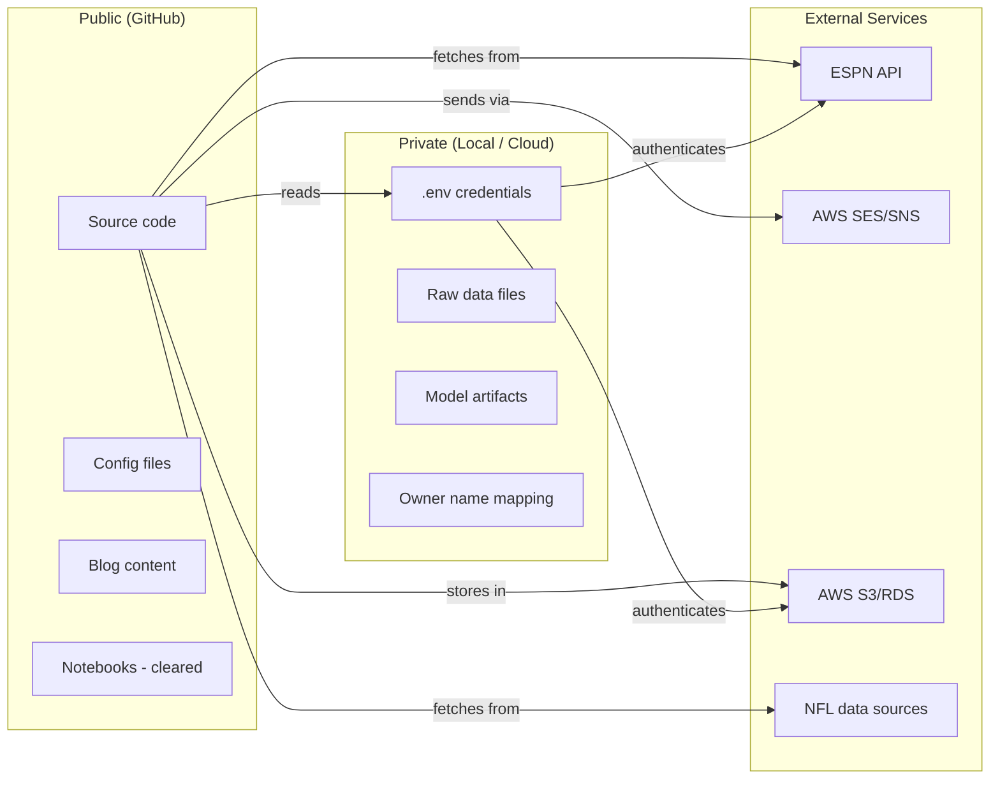

# Security & Privacy — Fanstatsy Foosball

## Overview

This project handles ESPN league credentials, AWS infrastructure credentials, and fantasy league data that includes real people's names (which must be anonymized). Since this is an open-source public repo, the security boundary is clear: **code and analysis are public, credentials and personal data are private.**

---

## Data Classification

| Data Type | Classification | Storage | Committed to Repo? |
|-----------|---------------|---------|-------------------|
| NFL player stats | Public | DuckDB / Parquet | No (fetched by scripts) |
| ESPN league data (anonymized) | Internal | DuckDB / Parquet | No (fetched by scripts) |
| League member real names | Private | `.env` mapping file only | **Never** |
| ESPN API credentials | Secret | `.env` | **Never** |
| AWS credentials | Secret | AWS CLI profiles / `.env` | **Never** |
| Model artifacts | Internal | `data/models/` (local), S3 (cloud) | No (gitignored) |
| Scoring config | Public | `configs/scoring.yaml` | Yes |
| Blog posts / analysis | Public | `notebooks/`, blog output | Yes |

---

## Credential Management

### ESPN Credentials

The `espn_api` package requires two authentication cookies for private leagues:

| Credential | What It Is | Where It Lives |
|-----------|-----------|---------------|
| `ESPN_S2` | Session cookie from ESPN.com | `.env` |
| `ESPN_SWID` | Unique identifier cookie | `.env` |
| `ESPN_LEAGUE_ID` | Your league's numeric ID | `configs/league.yaml` (not secret — visible in the ESPN URL) |

**How to get these:** Log into ESPN.com → open browser dev tools → Application tab → Cookies → copy `espn_s2` and `SWID` values.

**Rotation:** These cookies can expire. If API calls start failing with auth errors, refresh them from your browser.

### AWS Credentials

| Credential | What It Is | Where It Lives |
|-----------|-----------|---------------|
| `AWS_ACCESS_KEY_ID` | IAM user access key | AWS CLI profile (`~/.aws/credentials`) |
| `AWS_SECRET_ACCESS_KEY` | IAM user secret key | AWS CLI profile (`~/.aws/credentials`) |
| `AWS_DEFAULT_REGION` | Preferred region | AWS CLI profile or `.env` |

**Best practice:** Use named AWS CLI profiles, not environment variables. This prevents accidental exposure and supports multiple accounts.

```bash
# ~/.aws/credentials
[fanstatsy]
aws_access_key_id = ...
aws_secret_access_key = ...

# Usage in code
session = boto3.Session(profile_name="fanstatsy")
```

### IAM Principles

- **Least privilege** — each service gets only the permissions it needs
- **Separate IAM roles** for each Lambda function (not one shared role)
- **Never use root account credentials**
- **Enable MFA** on your AWS account

**IAM roles needed:**

| Resource | Permissions |
|----------|------------|
| Lambda (model serving) | S3 read (model artifacts), CloudWatch Logs write |
| Lambda (notifications) | SES send, SNS publish, CloudWatch Logs write |
| Lambda (ingestion) | S3 read/write (data lake), RDS connect, CloudWatch Logs write |
| CDK deploy role | CloudFormation full access (deployment only) |

---

## Anonymization

### Why

Your ESPN league includes real people — family members. Their names should never appear in a public GitHub repo, blog posts, or any committed file.

### How

1. **At ingestion time**, the ESPN API connector replaces owner display names with aliases
2. **Alias mapping** is stored in `.env` (never committed):
   ```
   OWNER_MAP='{"Real Name 1": "Manager_1", "Real Name 2": "Manager_2"}'
   ```
3. **`dim_fantasy_teams.owner_alias`** always contains the alias
4. **Your own team** is flagged with `is_user = true` for easy filtering
5. **Blog posts** use aliases or fun codenames — never real names
6. **Notebooks** — clear outputs before committing if they contain any owner data that slipped through

### Verification

- Pre-commit hook or CI check: grep committed files for known real names (loaded from `.env` at CI time via a secret)
- If a real name is found in any committed file, the build fails

---

## Trust Boundaries



### Boundary Rules

| Boundary | What Crosses | Protection |
|----------|-------------|------------|
| **Code → ESPN** | Auth cookies, league ID | Credentials from `.env`, HTTPS only |
| **Code → AWS** | IAM credentials, data payloads | AWS CLI profiles, IAM least privilege, HTTPS |
| **Code → NFL data** | HTTP requests | No auth needed (public data), HTTPS |
| **AWS → You** | Email/SMS notifications | SES verified sender, SNS confirmed phone number |
| **Code → GitHub** | Source code, configs, blog content | `.gitignore` blocks secrets and data, pre-commit hooks verify |

---

## Threat Model

### What Could Go Wrong

| Threat | Likelihood | Impact | Mitigation |
|--------|-----------|--------|------------|
| ESPN credentials committed to repo | Medium (easy mistake) | Medium — someone could access your league | `.gitignore`, pre-commit hooks, CI scan |
| AWS credentials committed to repo | Medium | High — unauthorized AWS charges | AWS CLI profiles (not env vars), `.gitignore`, pre-commit hooks, GitHub secret scanning |
| League member names in committed files | Medium | Low-Medium — privacy violation | Anonymization at ingestion, pre-commit name check |
| ESPN cookies expire without notice | High | Low — API calls fail, no data loss | Graceful error handling, clear error message, docs on how to refresh |
| AWS free tier exceeded | Medium | Medium — unexpected charges | AWS billing alerts ($5, $10 thresholds), resource tagging, regular cost review |
| Model artifacts too large for git | High | Low — slow repo, large clone | `.gitignore` for model files, S3 for artifact storage |
| Dependency with incompatible license | Low | Medium — legal issue for open source | License check before adding deps (see LICENSING.md) |

### Mitigations in Place

1. **`.gitignore`** blocks `.env`, `data/`, model artifacts
2. **Pre-commit hooks** detect private keys and large files
3. **GitHub secret scanning** (enabled by default on public repos) alerts on leaked credentials
4. **Anonymization at ingestion** — real names never reach the database
5. **AWS billing alerts** — set up during infrastructure setup
6. **IAM least privilege** — each component gets minimum required permissions

---

## Incident Response

If credentials are accidentally committed:

1. **Immediately rotate the credential** — don't just delete the commit, the credential is already in git history
   - ESPN: log out and back in to get new cookies
   - AWS: deactivate the access key in IAM console, create a new one
2. **Remove from git history** using `git filter-branch` or BFG Repo-Cleaner
3. **Check AWS CloudTrail** for any unauthorized usage (if AWS credentials were exposed)
4. **Add the specific credential pattern** to the pre-commit hook to prevent recurrence

---

## Notification Security

### Email (SES)

- **Verified sender** — SES requires verifying the sender email address
- **Send only to yourself** — no user-facing email, just personal notifications
- **No sensitive data in email body** — recommendations reference player names (public data) and aliases (anonymized), never real league member names

### SMS (SNS)

- **Confirmed phone number** — SNS requires confirming the recipient
- **Send only to your phone** — single recipient
- **Concise content** — SMS messages contain player recommendations, not credentials or private data

---

## Security Checklist (for each PR)

- [ ] No credentials, API keys, or secrets in code or commit history
- [ ] No real league member names in any committed file
- [ ] `.gitignore` covers all sensitive paths
- [ ] New dependencies checked for license compatibility
- [ ] Any new AWS resources use least-privilege IAM
- [ ] Error messages don't expose credentials or internal paths
- [ ] If a new external service is added, update this document's trust boundary diagram
